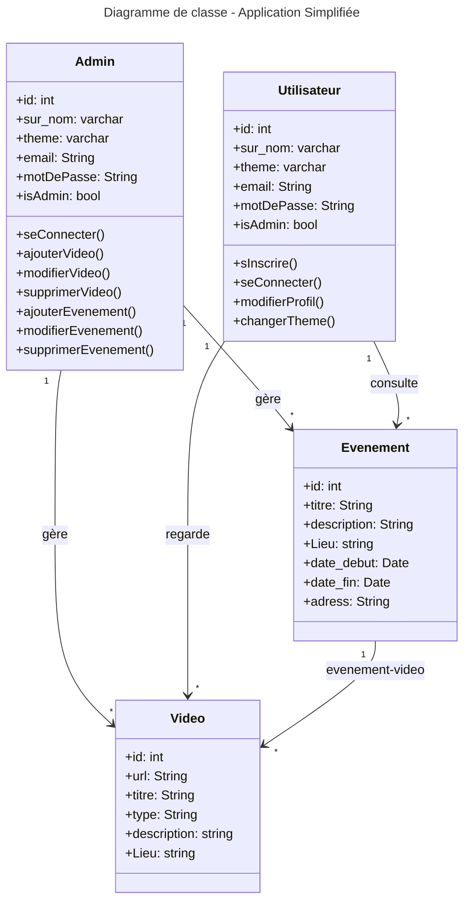

```mermaid
--- 
title: Diagramme de classe - Application Simplifiée 
---

classDiagram
    class Utilisateur {
        +id: int
        +sur_nom: varchar
        +theme: varchar
        +email: String
        +motDePasse: String
        +isAdmin: bool
        +sInscrire()
        +seConnecter()
        +modifierProfil()
        +changerTheme()
    }

    class Admin {
         +id: int
        +sur_nom: varchar
        +theme: varchar
        +email: String
        +motDePasse: String
        +isAdmin: bool
        +seConnecter()
        +ajouterVideo()
        +modifierVideo()
        +supprimerVideo()
        +ajouterEvenement()
        +modifierEvenement()
        +supprimerEvenement()
    }

    class Evenement {
        +id: int
        +titre: String
        +description: String
        +Lieu: string
        +date_debut: Date
        +date_fin: Date
        +adress: String
    }

    class Video {
        +id: int
        +url: String
        +titre: String
        +type: String
        +description: string
        +Lieu: string
    }

    Admin "1" --> "*" Evenement : gère
    Admin "1" --> "*" Video : gère
    Utilisateur "1" --> "*" Evenement : consulte
    Utilisateur "1" --> "*" Video : regarde
    Evenement "1" --> "*" Video : evenement-video


```