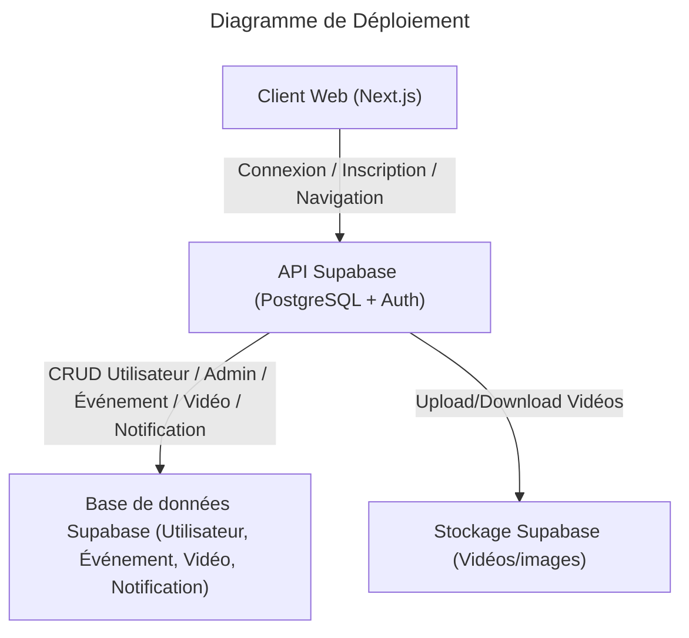

```mermaid
---
title: Diagramme de Déploiement
---

graph TD
    ClientWeb["Client Web (Next.js)"]
    SupabaseAPI["API Supabase (PostgreSQL + Auth)"]
    SupabaseDB["Base de données Supabase (Utilisateur, Événement, Vidéo, Notification)"]
    SupabaseStorage["Stockage Supabase (Vidéos/images)"]

    ClientWeb -->|Connexion / Inscription / Navigation| SupabaseAPI
    SupabaseAPI -->|CRUD Utilisateur / Admin / Événement / Vidéo / Notification| SupabaseDB
    SupabaseAPI -->|Upload/Download Vidéos| SupabaseStorage


```