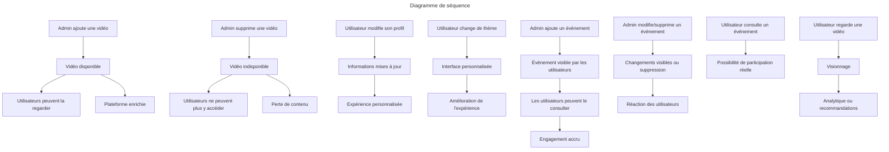

```mermaid
---
title: Diagramme de séquence 
---

graph TD
    A[Admin ajoute une vidéo] --> B[Vidéo disponible]
    B --> C[Utilisateurs peuvent la regarder]
    B --> D[Plateforme enrichie]

    E[Admin supprime une vidéo] --> F[Vidéo indisponible]
    F --> G[Utilisateurs ne peuvent plus y accéder]
    F --> H[Perte de contenu]

    I[Utilisateur modifie son profil] --> J[Informations mises à jour]
    J --> K[Expérience personnalisée]

    L[Utilisateur change de thème] --> M[Interface personnalisée]
    M --> N[Amélioration de l'expérience]

    O[Admin ajoute un événement] --> P[Événement visible par les utilisateurs]
    P --> Q[Les utilisateurs peuvent le consulter]
    Q --> R[Engagement accru]

    S[Admin modifie/supprime un événement] --> T[Changements visibles ou suppression]
    T --> U[Réaction des utilisateurs]

    V[Utilisateur consulte un événement] --> W[Possibilité de participation réelle]

    X[Utilisateur regarde une vidéo] --> Y[Visionnage]
    Y --> Z[Analytique ou recommandations]


```